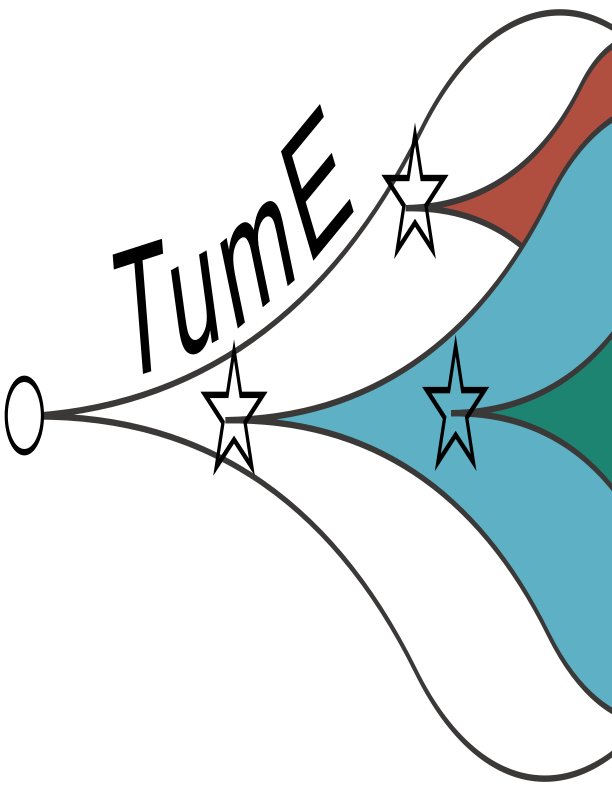

# Inferring cancer evolution from single tumour biopsies using synthetic supervised learning 



## Overview

**TumE** is a synthetic supervised learning method used to extract evolutionary parameters from single bulk sequenced tumour biopsies using the entire variant allele frequency (VAF) distribution. This work takes inspiration from an Approximate Bayesian Computation method developed by [Williams et al.](https://www.nature.com/articles/s41588-018-0128-6) for synthetic data generation, and a mixture model approach developed by [Caravagna et al.](https://www.nature.com/articles/s41588-020-0675-5) for modeling the neutral VAF spectrum with a Pareto distribution in tumour populations. Our approach is focused on utilizing deep learning models to extract relevant evolutionary information using only the VAF distribution. To capture uncertainty in our estimates, we perform an efficient bayesian approximation via Monte Carlo dropout ([Gal & Ghahramani](https://arxiv.org/pdf/1506.02142.pdf)) during classification and quantification of relevant evolutionary parameters. 

A preprint (version 1) is available [here](https://www.biorxiv.org/content/10.1101/2021.11.22.469566v1).

An online interactive supplementary section for this paper can be found [here](https://tomouellette.gitlab.io/ouellette_awadalla_2021/index.html).

## Installation

### One-liner

```python
python3 -m pip install 'git+https://github.com/tomouellette/TumE'
```

If the one-liner doesn't work for you, try the multi-line installation.

### Multi-liner

First clone TumE to a local directory.

```bash
git clone https://github.com/tomouellette/TumE
```

From the installed directory, build TumE using pip (tested on python3.7x - 3.9x).

```bash
python3 -m pip install .
```

or conda.

```bash
conda develop .
```

If install fails, please submit an issue with minimal code to reproduce.

Additional dependencies can be installed as follows

```bash
python3 -m pip install -r requirements.txt
```

## Basic usage

TumE works under the assumption that you have allele frequency and sequencing depth information from diploid regions of an individual tumour biopsy that have been purity corrected (where VAF and depth are vectors of length *N* corresponding to frequency and sequencing depth, alts + ref, for a given somatic mutation). You may use non-diploid regions if they have been copy-number corrected to a 'diploid' state, but this is generally only possible if you have allele/copy-specific mutation information. Furthermore, for accurate estimates we suggest sequencing tumours to >70-100x mean effective coverage (sequencing depth * purity). Samples with lower quality may lead to spurious results. The following example will generate TumE estimates with 50 MC samples and cluster subclones using the expected variance under binomial sequencing noise model.

```python
import TumE
import numpy as np
import pandas as pd

# > Load data frame with VAF and DP columns (Example: WGS from AML patient @ 320x sequencing depth, Griffith et al. 2015)
data = pd.read_csv(AML)

# > Generate estimates with 50 stochastic passes through network
estimates = TumE.infer.estimate(data, vaf_name = 'VAF', dp_name = 'DP', clustering = 'binomial', nmc = 50)

# > Parse estimates
all_mc_samples = estimates['all_estimates'] # A list of 8 numpy arrays containing MC samples for each task
predictions = estimates['predictions'] # Interpretable output of predicted labels and mean +/- CI estimates
annotated = estimates['annotated'] # Original dataframe with annotated mutations assigned to neutral, subclonal, or clonal

# > Plot
import matplotlib.pyplot as plt
TumE.plotting.plot(estimates)
plt.show()
```
<p align='center'></p>

One other import note for proper estimates! If you think your tumour purity estimates may be impacted by errors, we suggest running your VAF data through the `correct_vaf` function. `correct_vaf` adjusts VAFs subject to minor errors in purity estimates (essentially properly centering the diploid clonal cluster at 50% VAF). `correct_vaf` requires as input, a vector of VAFs from diploid mutations that have already been divided by the current purity estimate (e.g. VAF/purity).

```python
# Purity estimate
p = 0.8

# Adjust vafs for purity
uncorrected_vafs = original_vafs / p

# Correct vafs for slight errors in purity estimates
corrected_vafs = correct_vaf(vaf = uncorrected_vafs, fast=True)
```

## Inferring additional evolutionary parameters using transfer learned models

We used transfer learning to re-tune TumE models to predict mutation rate, subclone fitness, and subclone emergence time using an alternative simulation framework [TEMULATOR](https://t-heide.github.io/TEMULATOR/index.html). The function `TumE.infer.temulator_estimates` should be used after determining evolution model using standard `TumE.infer.estimate` function. Subclone parameter estimates are only currently available for the single subclone setting. Mutation rate estimates can be applied in any sample with sufficient depth and coverage.

```python
import TumE
import numpy as np
import pandas as pd

# > Load data frame with VAF and DP columns
data = pd.read_csv(sample)

# > Generate estimates using transfer learning models
predictions = TumE.infer.temulator_estimates(data, vaf_name='VAF', dp_name='DP', scaled_popsize=1e10)

# > Unpack estimates
mutrate, time, fitness, frequency = predictions
```

## References to tools for generating synthetic tumour sequencing data

- [CanEvolve.jl](https://github.com/tomouellette/CanEvolve.jl)
- [TEMULATOR](https://t-heide.github.io/TEMULATOR/index.html)
- [CancerSeqSim.jl](https://github.com/marcjwilliams1/CancerSeqSim.jl)
- [Cancer_Sim](https://github.com/mpievolbio-scicomp/cancer_sim)
